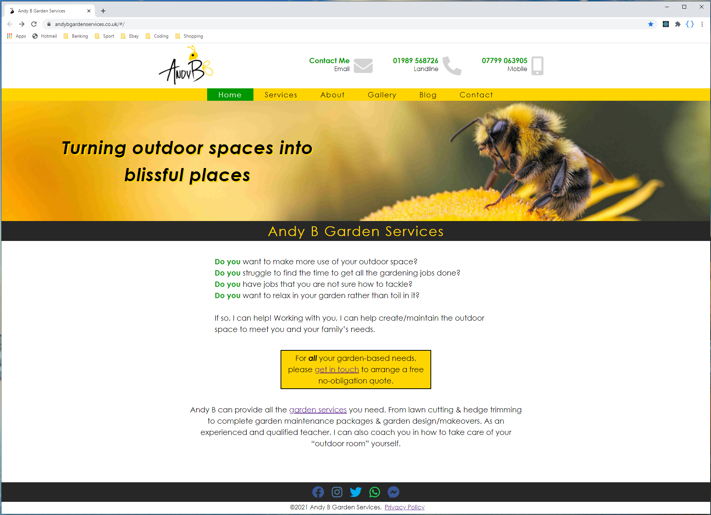

# Andy B Garden Services - Small Business Website

A Single Page Application built for a small business. The website uses React.js and is currently hosted on Netlify.

## Table of contents

- [General Information](#general-info)
- [Homepage Image](#homepage-image)
- [Technologies Used](#technologies-used)
- [Setup](#setup)
- [Features](#features)
- [Current Status](#current-status)
- [Contact](#contact)

## General info

The aim of this project was to create the first website for a newly created garden service company. The site functions as a place for the owner to describe their unique business offering and to advertise the services that they have to offer, along wth hosting their image and blog content. There are currently no plans for user accounts or an online store.

The project was initially a largely blank canvas with minimal content or styling put forward by the client. It was built using plain HTML5/CSS3, and went through several early overhauls as better ways of managing the project were found, along with the addition of new content. The decision was made to switch to React for a few reasons - for smoother navigation, to reduce the codebase for easier maintenance going forward and to provide experience working with a component-based Javascript library.

## Homepage Image

## Technologies Used

- HTML5
- CSS3
- React.js

## Setup

The website is currently hosted on Netlify, and can be found at https://www.andybgardenservices.co.uk.

## Code Example

#### The details of everything to be rendered on the gallery page are stored in a galleryImages object with the following structure:

    import TwistedHazelCatkins from "./Resources/Images/Gallery/twistedHazelCatkins.jpg";

    const galleryImages = {
        TwistedHazelCatkins: {
            image: TwistedHazelCatkins,
            description: "Twisted Hazel Catkins",
            alt: "Twisted Hazel Catkins",
        },
    };
    export default galleryImages;

#### This is then rendered by the GalleryCard component as follows:

    function GalleryCards() {
        function renderImageCard() {
            const galleryCards = [];
            for (const item in galleryImages) {
                galleryCards.push(
                    <figure className="galleryCard" key={item}>
                        <LazyLoadImage
                        src={galleryImages[item].image}
                        alt={galleryImages[item].alt}
                        />
                        <figcaption>{galleryImages[item].description}</figcaption>
                    </figure>
                );
            }
            return galleryCards;
        }
    return (<section className="galleryCardContainer">{renderImageCard()}</section>);
    }

#### ...this improves reusability and helps the website scale easily when more content is added

## Features

Some interesting features of the project:

- An interactive slide-scrolling before/after image feature that allows the user to see the client's work transform a garden from a previous job
- Use of Function Components to help separate and group the content (image urls, descriptions, etc) away from the structure and styling for easier maintenance
- Lazy-loading techniques to limit preloading of content until it is neccesary

Some things still to do:

- Implement a blog feature using API requests to a content hosting site such as Blogger
- Meet with the client to demonstrate how they can add content to the website on their own in future

## Current Status

Current status of https://www.andybgardenservices.co.uk: 

New content and features may be added in future based on the client's needs.

## Contact

For more information, please contact [@JakeMatthewsUK](https://www.jakematthews.uk/).
